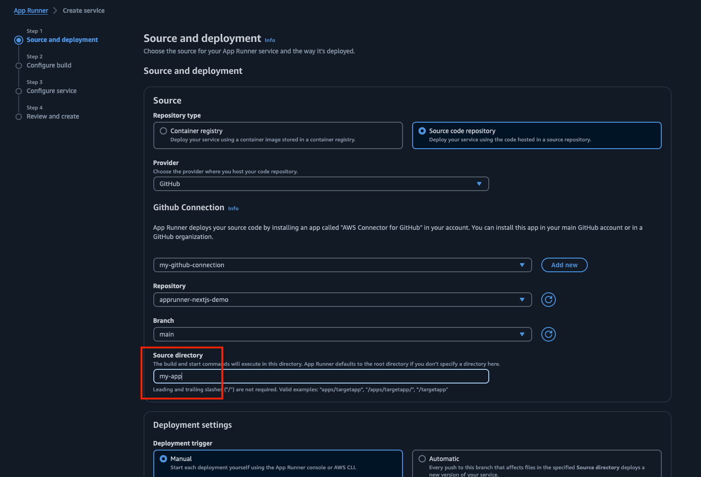

## Description
- This repository stores the code that was used to demonstrate Next.js on AWS App Runner.

## Deployment
- Select [GitHub](https://docs.aws.amazon.com/apprunner/latest/dg/service-source-code.html#service-source-code.providers) as the source provider for App Runner.
- Choose [your GitHub connection information](https://docs.aws.amazon.com/apprunner/latest/dg/getting-started.html#getting-started.create) and repository name.
- Enter "my-app" in the Source directory field.


## Supplement
- In the code of this repository, I have only tried running a simple Next.js application.
https://github.com/daihyo/apprunner-nextjs-demo/blob/main/my-app/apprunner.yaml
```
version: 1.0
runtime: nodejs18
build:
  commands:
    pre-build:
      - echo "test1"
      - npm ci
      - npm run build
    build:
      - echo "test2"
run:
  command: npm run start
  network: 
    port: 3000
```
